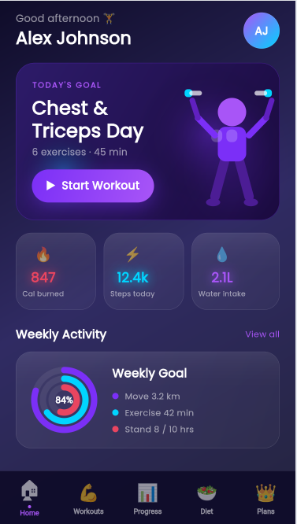
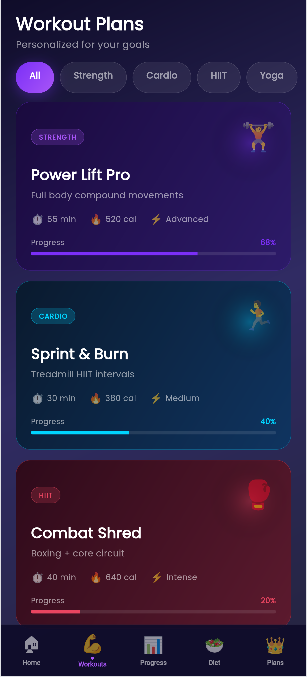
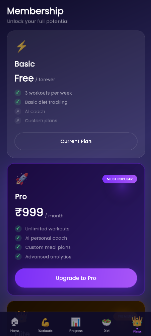
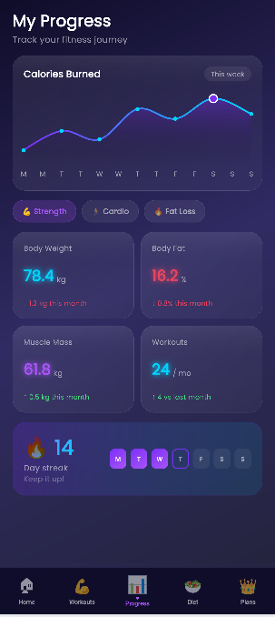
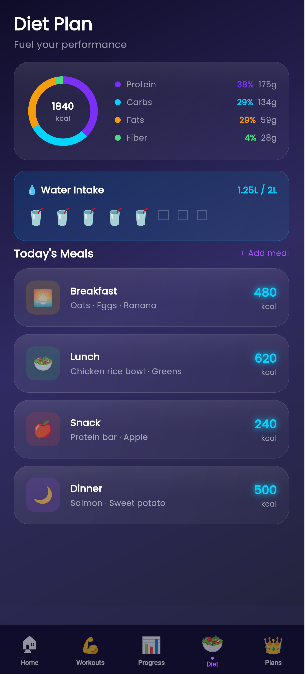
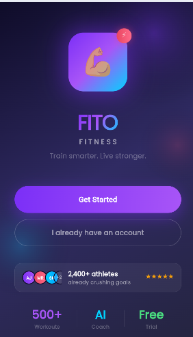
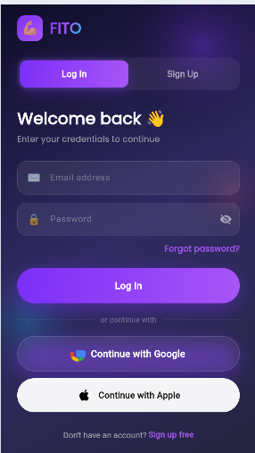
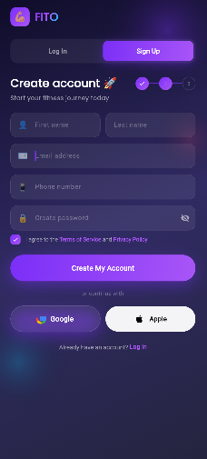
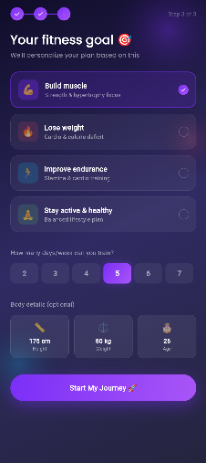
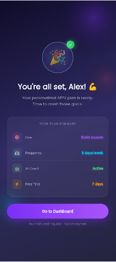

# fito

premium gym fitness app with glassmorphism UI, 3D avatar, and smooth animations.

## Project Structure

```
lib/
├── main.dart                    # App entry point
├── bindings/
│   └── app_binding.dart         # GetX dependency injection
├── controllers/
│   └── controllers.dart         # All GetX controllers
│       ├── NavController
│       ├── DashboardController
│       ├── WorkoutController
│       ├── ProgressController
│       ├── DietController
│       └── MembershipController
├── models/
│   └── models.dart              # Data models + AppData
├── screens/
│   ├── home_shell.dart          # Bottom nav + screen host
│   ├── dashboard_screen.dart    # Dashboard + 3D avatar
│   ├── workout_screen.dart      # Plans + detail sheet
│   ├── progress_screen.dart     # Charts + metrics
│   ├── diet_screen.dart         # Macros + meals
│   └── membership_screen.dart   # Subscription plans
├── widgets/
│   └── shared_widgets.dart      # GlassCard, GradientButton, etc.
└── utils/
    ├── app_theme.dart           # Colors, gradients, theme
    └── app_routes.dart          # GetX routing
```

## Setup

### 1. Create Flutter project
```bash
flutter create fito
cd fito
```

### 2. Replace files
Copy all files from this package into your project, preserving the directory structure.

### 3. Install dependencies
```bash
flutter pub get
```

### 4. Run
```bash
flutter run
```

## Key Dependencies

| Package | Use |
|---|---|
| `get` | State management, routing, DI |
| `fl_chart` | Line chart on progress screen |
| `google_fonts` | Poppins font |
| `animate_do` | FadeIn/SlideIn animations |
| `percent_indicator` | Ring indicators |

## Features

- **Dashboard** — 3D CustomPainter avatar, activity rings, stats
- **Workouts** — Filter tabs, progress bars, bottom-sheet detail
- **Progress** — fl_chart line chart, metric grid, streak tracker
- **Diet** — Macro donut chart, water cup toggle, meal cards
- **Membership** — Tiered plan cards, GetX snackbar feedback

## Architecture

- **GetX** for reactive state (`Rx`, `Obx`)
- **Lazy-loaded** controllers via `AppBinding`
- **Stateless widgets** throughout — all state in controllers
- **CustomPainter** for avatar + ring graphics (no external assets needed)

# 💪 Fito — Premium Gym Fitness App

Premium gym fitness app with glassmorphism UI, 3D avatar, and smooth animations.

---

## 📸 Screenshots

### 🏠 Home & Dashboard
| | |
|---|---|
|  |  |

### 🏋️ Workout & Plan
| | |
|---|---|
|  |  |

### 📊 Progress & Diet
| | |
|---|---|
|  |  |

### 🎯 More Screens
| | | |
|---|---|---|
|  |  |  |
|  |  | |

